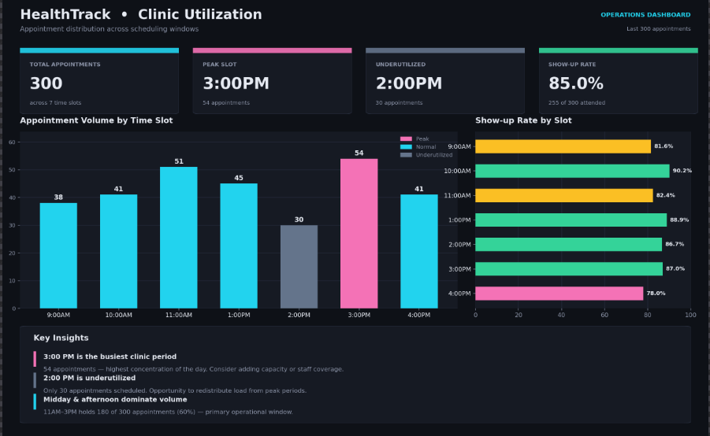
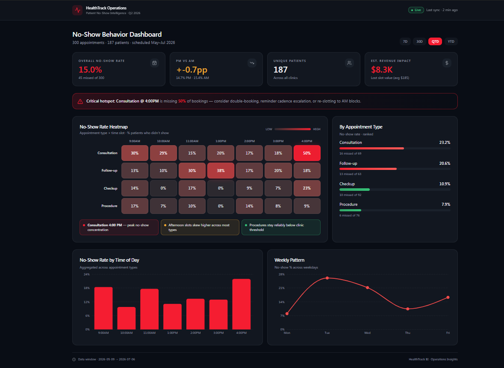
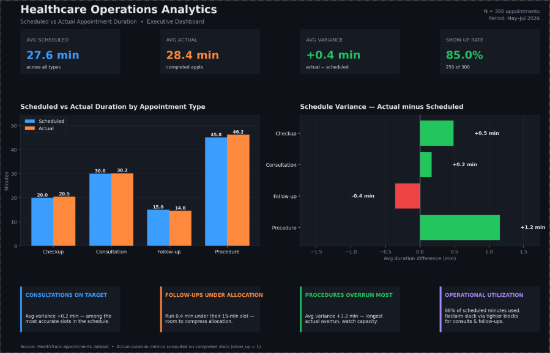

# HealthTrack Clinic Analytics Platform

## Healthcare Operations Analytics & Scheduling Intelligence System


---

# Project Overview

HealthTrack Clinic Analytics is a healthcare operations analytics platform designed to simulate, analyze, and visualize clinic appointment performance using Python, SQLAlchemy, SQLite, and business intelligence workflows.

This project demonstrates how healthcare organizations can leverage operational analytics and scheduling intelligence to reduce no-show rates, optimize appointment utilization, monitor operational efficiency, and improve data-driven decision-making.

The platform generates realistic synthetic healthcare appointment data and transforms it into actionable business insights through operational analytics and dashboard visualizations.

This project combines:

- Healthcare Analytics
- Data Engineering
- Operational Intelligence
- Dashboard Visualization
- Business Intelligence
- Python Backend Development

into a real-world healthcare analytics solution.

---

# Business Problem

Healthcare clinics and hospital operations teams frequently face challenges such as:

- High patient no-show rates
- Appointment scheduling inefficiencies
- Appointment overruns
- Underutilized provider schedules
- Long patient wait times
- Limited operational visibility
- Poor resource allocation

Without analytics systems, healthcare organizations often struggle to identify:

- Peak no-show periods
- Operational bottlenecks
- Delayed appointment categories
- Inefficient scheduling windows
- Provider utilization patterns
- Clinic productivity losses

This project addresses these operational challenges by building a healthcare analytics system capable of generating measurable operational insights for smarter scheduling and clinic management.

---

# Project Objectives

The primary goals of this project are to:

- Generate realistic synthetic healthcare appointment datasets
- Build a relational healthcare database using SQLAlchemy ORM
- Analyze scheduling efficiency and operational performance
- Detect patient no-show trends
- Measure appointment duration variances
- Simulate operational healthcare workflows
- Create healthcare KPI dashboards and visualizations
- Demonstrate healthcare analytics engineering workflows
- Support data-driven healthcare decision-making

---

# Key Features

## Operational Analytics Engine
- Appointment utilization analysis
- No-show trend monitoring
- Scheduling efficiency tracking
- Appointment duration variance analysis
- Clinic productivity reporting

## Healthcare Data Simulation
- Realistic synthetic patient records
- Appointment scheduling simulation
- Provider workflow modeling
- Operational healthcare dataset generation

## Dashboard Visualization
- Clinic utilization dashboards
- No-show heatmaps
- Appointment variance visualizations
- Operational KPI reporting

## Database Engineering
- SQLAlchemy ORM implementation
- SQLite relational database integration
- Structured healthcare operational datasets
- CSV export reporting pipeline

---

# Technologies Used

| Technology | Purpose |
|---|---|
| Python | Core application development |
| Pandas | Data analysis and transformation |
| SQLAlchemy | ORM and relational database management |
| SQLite | Local database storage |
| Faker | Synthetic healthcare data generation |
| Streamlit | Interactive analytics dashboard |
| Matplotlib | Data visualization |
| Seaborn | Statistical visualization |
| Lovable AI | Dashboard UI visualization and prototyping |
| VS Code | Development environment |
| Git & GitHub | Version control and project hosting |

---

# Project Structure

```plaintext
healthtrack-clinic-analytics/
│
├── app.py
├── analysis.py
├── database.py
├── models.py
├── seed.py
├── requirements.txt
├── README.md
├── .gitignore
├── healthtrack_appointments.csv
│
├── CLINIC UTILIZATION TIMELINE.png
├── NO-SHOW HEATMAP VISUALIZATION.png
├── SCHEDULED VS ACTUAL DURATION.png
```

---

# Dataset Description

The project generates simulated healthcare appointment records containing operational scheduling metrics and appointment performance indicators.

## Dataset Fields

| Column | Description |
|---|---|
| patient_id | Unique patient identifier |
| patient_age | Patient age |
| appointment_type | Type of clinic appointment |
| appointment_datetime | Scheduled appointment timestamp |
| day_of_week | Appointment weekday |
| time_slot | Clinic scheduling time slot |
| scheduled_duration | Expected appointment duration |
| actual_duration | Actual appointment duration |
| duration_difference | Variance between expected and actual duration |
| show_up | Patient attendance status |
| created_at | Record creation timestamp |

---

# Operational Analytics Logic

## Appointment Variance Formula

```python
duration_difference = actual_duration - scheduled_duration
```

## Interpretation

| Value | Meaning |
|---|---|
| Positive | Appointment exceeded scheduled duration |
| Negative | Appointment ended early or patient no-show |
| Zero | Appointment duration matched expectation |

This operational metric helps healthcare organizations identify:

- Scheduling inefficiencies
- Operational bottlenecks
- Provider workload imbalance
- Lost clinic productivity
- Overtime appointment trends

---

# 1. Installation & Setup

## Clone Repository

```bash
git clone https://github.com/YOUR_USERNAME/healthtrack-clinic-analytics.git
cd healthtrack-clinic-analytics
```

---

## 2. Create Virtual Environment

### Windows

```powershell
python -m venv .venv
```

Activate environment:

```powershell
.venv\Scripts\activate
```

---

## 3. Install Dependencies

```bash
pip install -r requirements.txt
```

---

## 4. Generate Healthcare Dataset

```bash
python seed.py
```

This process will:

- Generate synthetic healthcare appointment data
- Populate the SQLite database
- Simulate clinic scheduling workflows
- Create operational appointment variance records
- Simulate patient no-show behavior

---

## 5. Run Analytics Dashboard

```bash
streamlit run app.py
```

The Streamlit dashboard automatically launches in your browser.

---

## 6. Run Operational Analytics

```bash
python analysis.py
```

This generates:

```plaintext
healthtrack_appointments.csv
```

The analytics workflow performs:

- No-show analysis
- Scheduling efficiency analysis
- Appointment duration variance reporting
- Operational healthcare KPI generation

---

# Dashboard Visualizations

## Clinic Utilization Timeline



---

## No-Show Heatmap Visualization



---

## Scheduled vs Actual Duration Analysis



---

# Business Intelligence Insights

The analytics platform helps answer operational questions such as:

- Which appointment types experience the highest delays?
- Which time slots have the highest no-show rates?
- What weekdays create operational bottlenecks?
- How much clinic productivity is lost due to missed appointments?
- Which scheduling windows reduce operational efficiency?

---


# Example Analytics Performed

## No-Show Analytics
- Attendance trend monitoring
- Peak no-show period identification
- Time-slot attendance analysis

## Scheduling Efficiency Analysis
- Appointment variance tracking
- Provider utilization monitoring
- Operational bottleneck detection

## Clinic Utilization Reporting
- Scheduling demand analysis
- Appointment frequency reporting
- Clinic workload distribution

---


# Why This Project Matters

Healthcare organizations rely heavily on operational efficiency to improve:

- Patient experience
- Scheduling optimization
- Provider utilization
- Resource allocation
- Operational visibility

This project demonstrates how analytics engineering and healthcare intelligence can work together to solve real-world operational challenges using scalable Python technologies and modern business intelligence workflows.

---


# Author

## Precious Ajayi

AI Business Solutions Fellow | Aspiring DevOps Engineer | Cloud & Data Analytics Enthusiast

### GitHub Profile

https://github.com/AjB101

---


